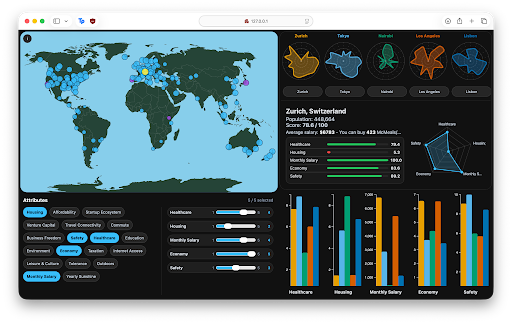
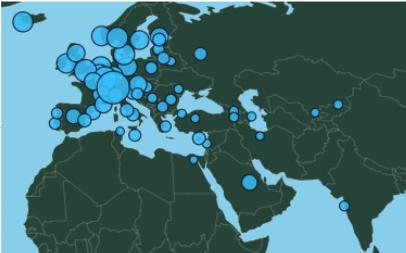
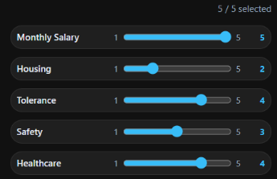
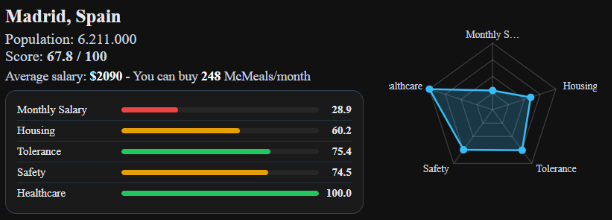
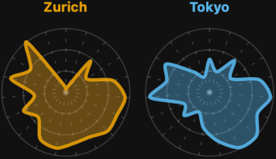
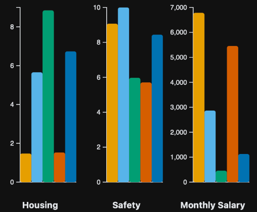

# Independence City Finder

An interactive visual analytics dashboard for exploring and comparing cities according to factors related to financial, residential, and personal independence.

The application combines heterogeneous urban datasets into a unified multidimensional city profile. Users can select the attributes that matter to them, assign different importance weights, explore cities geographically, and compare detailed city profiles through coordinated visualizations.

**Live application:**  
https://javjerez.github.io/independence-city-finder/

<p align="center">
  
</p>

## Project Overview

Choosing a city in which to live independently involves several competing factors. A city may offer high salaries but expensive housing, affordable living but limited career opportunities, or a high quality of life with other practical disadvantages.

Most conventional city-ranking platforms present fixed rankings or isolated statistics. These approaches make it difficult to:

- evaluate several factors simultaneously;
- understand trade-offs between cities;
- adapt the ranking to individual priorities;
- compare the overall profiles of multiple alternatives.

Independence City Finder addresses this problem through an interactive visual analytics approach. Instead of presenting a single definitive ranking, the dashboard allows users to construct and explore their own decision criteria.

The project was developed for the **DT056A Visualization** course at Mid Sweden University as part of the Erasmus Mundus Joint Master in Imaging.

## Main Features

- Interactive world map containing 138 cities.
- Selection of up to five indicators at a time.
- User-defined importance weights for each selected indicator.
- Dynamic recalculation of city scores.
- Geographic overview using score-scaled city markers.
- Selection of one primary city and up to four comparison cities.
- Detailed city cards combining numerical and graphical information.
- Radar charts for multidimensional city profiling.
- Bar charts for direct attribute-level comparison.
- Tooltips and information panels providing details on demand.
- Political and relief map representations.
- Coordinated updates across the different visual views.

## Dashboard Interaction

The dashboard is organised as a set of coordinated views. An action performed in one component updates the other relevant components, allowing the user to move between overview, comparison, and detailed inspection without losing context.

### Geographic Overview

Cities are represented as circles positioned using their geographic coordinates. Circle size is derived from the current city score.

<p align="center">
  
</p>

This view provides an overview of the geographical distribution of the available cities. It also acts as a selection interface: choosing a city on the map updates the detailed city view and the comparison visualizations.

### Attribute Selection and Weighting

Users can select up to five attributes and assign each one a weight from 1 to 5.

<p align="center">
  
</p>

Changing a weight triggers an immediate recomputation of the score for every city. This supports interactive *what-if* analysis: users can observe how city rankings change when their priorities change.

### City Card

The City Card acts as the main details-on-demand component.

<p align="center">
  
</p>

It combines:

- city and country name;
- population;
- overall weighted score;
- average salary;
- a contextual salary-to-meal-price comparison;
- individual normalized attribute indicators;
- a radar profile for the currently selected attributes.

The numerical values provide precision, while the graphical indicators make strengths and weaknesses easier to identify quickly.

### Multidimensional City Profiles

Radar charts provide a compact visual signature for each city.

<p align="center">
  
</p>

Each axis represents one attribute. The shape of the polygon summarizes the relative profile of the city across several dimensions.

Radar charts are useful for identifying broad patterns and contrasting profiles, although they are less precise than position- or length-based charts for comparing individual numerical values.

### Attribute Comparison

Bar charts support direct comparison of selected cities for individual attributes.

<p align="center">
  
</p>

Unlike the radar charts, the bar charts use position and length, which are more accurate perceptual channels for comparing quantitative values.

## City Score

The dashboard computes a customizable composite score for each city using a weighted arithmetic mean.

For a city \(c\), the score is:

\[
\text{Score}(c) =
\frac{\sum_{i=1}^{n} w_i a_i(c)}
{\sum_{i=1}^{n} w_i}
\]

where:

- \(a_i(c)\) is the normalized value of attribute \(i\) for city \(c\);
- \(w_i\) is the weight selected by the user;
- \(n\) is the number of selected attributes with valid values for that city.

### Normalization

Attributes originate from datasets with different units and ranges. Before they can be combined, each quantitative attribute is normalized using min-max normalization:

\[
a_i(c) =
\frac{x_i(c)-\min(x_i)}
{\max(x_i)-\min(x_i)}
\]

This maps values to a common range between 0 and 1.

The displayed score is scaled to a 0–100 range.

### Inverted Metrics

The scoring system supports metrics for which lower original values are preferable, such as costs. For those variables, the normalized direction can be inverted so that a larger normalized score consistently represents a more favourable result.

The current set of selectable indicators is configured so that higher values represent better outcomes. The inversion mechanism is retained for non-selectable contextual cost variables such as meal price and Internet cost.

### Missing Values

When a city does not contain a valid value for a selected attribute, that attribute is excluded from both the numerator and denominator of the weighted score for that city.

This avoids treating missing information as a score of zero. However, it also means that cities with missing data may be evaluated using different subsets of attributes. The score should therefore be interpreted as an exploratory comparison aid rather than as a statistically validated universal ranking.

## Dataset

After preprocessing, the runtime dataset contains:

- **138 cities**;
- **19 selectable attributes**;
- geographic coordinates and contextual city information.

The selectable attributes are:

| Category | Attributes |
|---|---|
| Cost and financial conditions | Housing, Affordability, Monthly Salary, Taxation |
| Professional environment | Startup Ecosystem, Venture Capital, Business Freedom, Economy |
| Infrastructure and connectivity | Travel Connectivity, Commute, Internet Access |
| Quality of life | Safety, Healthcare, Education, Environment |
| Lifestyle | Leisure & Culture, Tolerance, Outdoors, Yearly Sunshine |

Additional contextual variables include population, meal price, and Internet cost.

The academic project considered several public datasets covering quality of life, cost of living, salaries, Internet connectivity, climate, happiness, and world-city metadata. The preprocessing workspace retains original and intermediate datasets to document the data-integration process.

The final dashboard primarily exposes information originating from sources such as:

- Teleport city quality-of-life data;
- Numbeo-derived cost and salary indicators;
- city sunshine data;
- world-city geographic and population metadata.

Because the upstream datasets come from different providers, their licenses and redistribution conditions should be checked independently before reusing the data outside this academic and portfolio context.

## Data Processing Pipeline

The project follows the classical visualization pipeline studied in the course:

```text
Raw datasets
      ↓
Data cleaning and formatting
      ↓
City-name reconciliation
      ↓
Dataset merging
      ↓
Missing-value handling
      ↓
Attribute selection and renaming
      ↓
Runtime JSON dataset
      ↓
Normalization and weighted scoring
      ↓
Visual mapping and rendering
```

The preprocessing stage includes:

1. loading heterogeneous tabular datasets;
2. removing duplicate or inconsistent records;
3. reconciling different city naming conventions;
4. merging records across sources;
5. preserving or excluding missing values according to their use;
6. renaming attributes to more user-friendly terms;
7. exporting the final data into JSON files consumed by the dashboard.

The preprocessing notebook and original datasets are retained in the repository for transparency and reproducibility analysis. Complete reproducibility still depends on the availability, version, and licensing conditions of the original external datasets.

## Visualization Design

The dashboard was designed around several principles from information visualization and human-computer interaction.

### Overview First, Details on Demand

The world map provides an initial overview of all available cities. Users can then select individual cities to inspect exact values and detailed profiles.

This follows the interaction principle:

> Overview first, zoom and filter, then details on demand.

### Coordinated Multiple Views

The map, City Card, radar charts, comparison bars, and controls represent different views of the same underlying state.

Selecting a city or changing a weight propagates through the interface. This coordination reduces the need to mentally reconcile unrelated charts and allows users to maintain context during exploration.

The system implements linked selection and coordinated updates. It does not currently provide full brushing through graphical range or region selection.

### Marks and Visual Channels

The interface maps data to different graphical marks and channels:

| Data element | Mark | Visual channel |
|---|---|---|
| City location | Circle | Geographic position |
| City score | Circle | Size |
| City identity | Bars and radar polygons | Color |
| Attribute value | Bar | Length and position |
| Multidimensional profile | Radar polygon | Radial distance |
| Attribute importance | Slider | Position |
| Favourable or unfavourable state | Indicator bar | Color and length |

Position and length are used for detailed quantitative comparison because they generally support more accurate judgments than area, angle, or polygon shape.

Area and radar shape are primarily used for overview and profile recognition, not for precise numerical reading.

### Multidimensional Data

Each city is represented as a multivariate table record containing many attributes.

The interface addresses this dimensionality through:

- attribute selection;
- weighted aggregation;
- compact radar profiles;
- one-dimensional comparison bars;
- textual values for precision.

Selecting a subset of attributes is a user-controlled form of dimensionality reduction. Rather than automatically projecting the data using techniques such as PCA, the dashboard allows users to choose the dimensions that are meaningful for their decision.

### Color and Preattentive Processing

Color helps users quickly distinguish cities and identify favourable, intermediate, and unfavourable indicators.

The comparison palette is based on the Okabe–Ito color-blind-accessible palette. Color is combined with other channels such as position, length, labels, and numerical values so that important information is not communicated through color alone.

The indicator bars use a traffic-light-inspired semantic mapping:

- green for favourable values;
- orange for intermediate values;
- red for less favourable values.

Although this mapping is familiar to many users, red–green semantics can still present accessibility issues for some forms of colour-vision deficiency. Redundant numerical labels and bar length partially mitigate this limitation.

### Visual Comparison

The dashboard combines representations with different strengths:

- the **map** provides geographical context;
- **radar charts** reveal multidimensional profiles;
- **bar charts** support more precise value comparison;
- **textual values** provide exact quantities;
- the **aggregate score** offers a simplified overview.

No single representation is sufficient for all analytical tasks. The coordinated design allows users to move between them according to the question being investigated.

## Technical Implementation

The dashboard is implemented as a static client-side web application using:

- HTML5;
- modular CSS;
- JavaScript ES Modules;
- D3.js;
- TopoJSON Client;
- World Atlas geographic data.

The application entry point is:

```text
dashboard/index.html
```

The main JavaScript module initializes:

```text
application state
attribute controls
world map
comparison bars
radar charts
city card
```

The runtime data is loaded from:

```text
dashboard/data/pretty_columns_dataset.json
dashboard/data/attributes.json
```

External libraries and geographic data are loaded through CDNs. An Internet connection is therefore required unless those dependencies are downloaded and served locally.

## Repository Structure

```text
.
├── dashboard/
│   ├── index.html
│   ├── assets/
│   ├── css/
│   ├── js/
│   └── data/
│       ├── pretty_columns_dataset.json
│       └── attributes.json
├── data/
│   ├── original datasets
│   ├── intermediate datasets
│   └── processed datasets
├── construct_dataset.ipynb
├── report/
│   └── Report.pdf
├── presentation/
│   └── Presentation.pdf
├── docs/
│   └── images/
├── .github/
│   └── workflows/
│       └── deploy-pages.yml
├── .gitignore
└── .gitattributes
```

### Runtime Files

The deployed application requires:

```text
dashboard/index.html
dashboard/js/
dashboard/css/
dashboard/assets/
dashboard/data/
```

### Reproducibility and Academic Material

The following files are not required by the browser at runtime, but are retained to document the academic and data-processing work:

```text
data/
construct_dataset.ipynb
report/
presentation/
```

## Running Locally

Because the application loads JSON files and JavaScript modules, it should be served through a local HTTP server rather than opened directly using a `file://` URL.

From the repository root:

```bash
cd dashboard
python -m http.server 8000
```

Then open:

```text
http://localhost:8000
```

Alternative development servers, such as the VS Code Live Server extension, can also be used.

## Deployment

The dashboard is deployed through GitHub Pages using a GitHub Actions workflow.

The deployment publishes the contents of the `dashboard/` directory as a static website.

Live version:

https://javjerez.github.io/independence-city-finder/

## Evaluation

The application was evaluated during development through iterative functional inspection and design review.

The evaluation focused on whether:

- attribute selection updated the visualizations correctly;
- weight changes recalculated the score;
- city selection propagated across coordinated views;
- comparison charts displayed consistent city identities;
- tooltips and details-on-demand were available;
- the interface remained readable under different selections;
- colors and contrast were reasonably distinguishable.

A formal participant-based usability study was not conducted. Consequently, the project does not claim validated improvements in task completion time, decision accuracy, cognitive load, or user satisfaction.

A stronger future evaluation could combine:

- heuristic evaluation by visualization or HCI experts;
- cognitive walkthroughs for key workflows;
- qualitative user interviews;
- task-based observation;
- quantitative measurements of completion time and error rates;
- questionnaires assessing usability and perceived usefulness.

## Limitations

The current project has several important limitations:

- The composite score depends on subjective attribute and weighting choices.
- A weighted average can hide strong weaknesses behind strengths in other attributes.
- The score is not a validated economic, social, or scientific index.
- Missing values can cause different cities to be scored using different subsets of attributes.
- Min-max normalization is sensitive to extreme values.
- Radar-chart interpretation depends on axis order and is less precise than bar-based comparison.
- Circle size on the map relies on area perception, which is less accurate than position or length.
- Dense geographic regions may contain overlapping city markers.
- The traffic-light color mapping is not fully accessible without its accompanying labels and bar lengths.
- The dataset represents a particular time period and should not be treated as current real-time information.
- Data quality depends on the methodologies and update frequencies of the original providers.
- No formal user study was conducted.
- The interface was created as an academic visualization project rather than as a production relocation recommendation service.

The results should therefore support exploration and comparison, not replace independent research or professional financial, legal, or relocation advice.

## Potential Improvements

Possible extensions include:

- explicit filtering by country or region;
- search by city name;
- uncertainty and missing-data indicators;
- normalization alternatives robust to outliers;
- visual explanation of score contributions;
- ranking stability analysis under changing weights;
- saved preference profiles;
- improved keyboard navigation;
- responsive mobile layouts;
- redundant patterns or shapes for additional color accessibility;
- formal usability evaluation;
- automated validation of the data-processing pipeline;
- clearer provenance at the individual-attribute level.

These are possible future directions and are not implemented in the current version.

## Academic Report and Presentation

The repository includes the final academic materials:

- [Project report](report/Report.pdf)
- [Project presentation](presentation/Presentation.pdf)

These documents provide additional context on the initial problem definition, related work, design decisions, and academic evaluation.

## Authors and Project History

This was a collaborative academic project developed by:

- **Javier Jerez Reinoso**
- **Marco Zennaro**

The Git history preserves the original collaborative development and authorship.

The original repository is maintained as the `upstream` remote:

```text
https://github.com/zenna7/Urban-Independence-Index.git
```

This independent portfolio repository is maintained under:

```text
git@github.com:javjerez/independence-city-finder.git
```

After completion of the original academic project, Javier Jerez Reinoso prepared this repository for public portfolio presentation. This later work included repository cleanup, removal of obsolete files and comments, preservation of the academic report and presentation, documentation work, and GitHub Pages deployment configuration.

This repository history distinction is intended to preserve both the collaborative nature of the original work and the subsequent portfolio-maintenance work.

## Acknowledgements

This project was developed for the DT056A Visualization course at Mid Sweden University within the Erasmus Mundus Joint Master in Imaging.

The project applies concepts from the course including:

- the visualization pipeline;
- information visualization for abstract multidimensional data;
- visual mapping;
- marks and visual channels;
- perceptual effectiveness;
- coordinated multiple views;
- interaction and details on demand;
- normalization and aggregation;
- color perception and accessibility;
- visualization evaluation.

## License and Data Usage

A software license should be selected explicitly before third parties are encouraged to reuse the source code.

The datasets originate from external providers and may be subject to separate terms, attribution requirements, or redistribution restrictions. Inclusion of data files in this academic repository does not imply that all underlying datasets are released under the same license as the source code.
